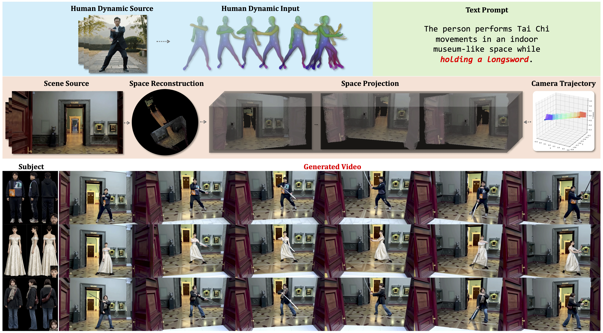
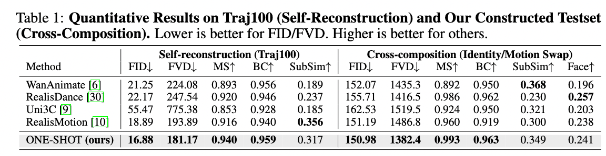
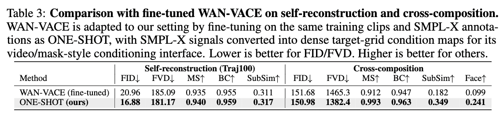

# ONE-SHOT：Compositional Human-Environment Video Synthesis via Spatial-Decoupled Motion Injection and Hybrid Context Integration

<div align="center">
  <a href="./README.md">English</a> | <a href="./README_zh.md">简体中文</a>
</div>

<div align="center">
  <a href="https://arxiv.org/abs/2604.01043" target="_blank"></a>
  <a href="https://martayang.github.io/ONE-SHOT/" target="_blank"></a>
  <a href="https://huggingface.co/MartaYang007/ONE-SHOT-14B" target="_blank"></a>
  <a href="https://github.com/MartaYang/ONE-SHOT-code" target="_blank"></a>
</div>

<div align="center">
  Fengyuan Yang<sup>1,2</sup>&nbsp;&nbsp;
  Luying Huang<sup>2,&dagger;</sup>&nbsp;&nbsp;
  Jiazhi Guan<sup>2,&#9993;</sup>&nbsp;&nbsp;
  Quanwei Yang<sup>2</sup>&nbsp;&nbsp;
  Dongwei Pan<sup>2</sup>&nbsp;&nbsp;
  Jianglin Fu<sup>2</sup>&nbsp;&nbsp;
  Haocheng Feng<sup>2</sup>&nbsp;&nbsp;
  Wei He<sup>2</sup>&nbsp;&nbsp;
  Kaisiyuan Wang<sup>2</sup>&nbsp;&nbsp;
  Hang Zhou<sup>2,&#9993;</sup>&nbsp;&nbsp;
  Angela Yao<sup>1</sup>
</div>

<div align="center">
  <sup>1</sup> 新加坡国立大学 &nbsp;&nbsp;
  <sup>2</sup> 百度 AMU
</div>

<div align="center">
  &dagger; 项目负责人 &nbsp;&nbsp; &#9993; 通讯作者 &nbsp;&nbsp;
  该工作完成于 Fengyuan 在百度实习期间
</div>

**ONE-SHOT: Compositional Human-Environment Video Synthesis via Spatial-Decoupled Motion Injection and Hybrid Context Integration** 的官方推理代码。

ONE-SHOT 是一个面向可控人-环境视频生成框架。它支持对主体身份、人体运动、场景上下文和相机轨迹进行独立控制，同时在长视频生成中保持稳定的身份一致性和人-环境交互。

## 🧾 摘要

近期视频基础模型（Video Foundation Models, VFMs）的发展显著推动了以人为中心的视频合成，但对主体和场景进行细粒度、独立编辑仍然是关键挑战。我们提出 **ONE-SHOT**，能够以高保真方式合成人-环境视频，并独立控制主体外观、人体动作、空间环境和相机轨迹。通过注入静态与动态上下文，ONE-SHOT 能够在分钟级生成中保持主体身份一致，并稳定建模人-环境交互。

## 🖼️ 概览



## 📰 更新

- 🔥 **`2026/05/31`**：`ONE-SHOT-14B` diffusers checkpoint 可从 [Hugging Face](https://huggingface.co/MartaYang007/ONE-SHOT-14B) 下载。
- 🔥 **`2026/04/01`**：ONE-SHOT 论文已发布在 [arXiv](https://arxiv.org/abs/2604.01043)。
- 🔥 **`2026/04/01`**：ONE-SHOT 项目材料已发布在 [项目主页](https://martayang.github.io/ONE-SHOT/)。

## 📊 指标





## 🚀 快速开始

### 🛠️ 安装

推荐环境：

- Linux
- NVIDIA GPU
- 兼容 CUDA 12.1 的驱动
- Python 3.12
- 支持 `libx264` 的 `ffmpeg`

```bash
git clone https://github.com/MartaYang/ONE-SHOT-code.git
cd ONE-SHOT-code

bash install.sh
conda activate oneshot
```

安装脚本会创建 `oneshot` conda 环境，安装启用 GPL 的 `ffmpeg`、PyTorch `2.5.1+cu121`、仓库内置的 PyTorch3D wheel，并安装 `requirements.txt` 中的依赖。

<details>
<summary>手动安装命令</summary>

```bash
conda create -n oneshot python=3.12 -y
conda activate oneshot

conda install 'ffmpeg=*=*gpl*' -y

pip install --index-url https://download.pytorch.org/whl/cu121 \
    torch==2.5.1+cu121 torchvision==0.20.1+cu121 torchaudio==2.5.1+cu121

pip install Preprocessing/third_party/wheels/pytorch3d-0.7.9-cp312-cp312-manylinux_2_31_x86_64.whl
pip install -r requirements.txt
```

</details>

### 📦 Checkpoints

下载已发布的 checkpoint，并设置 `ONESHOT_MODEL_DIR`：

```bash
huggingface-cli download MartaYang007/ONE-SHOT-14B \
    --local-dir pretrained_models/ONESHOT-14B-diffusers

export ONESHOT_MODEL_DIR=pretrained_models/ONESHOT-14B-diffusers
```

推荐的本地 checkpoint 目录结构如下：

```text
pretrained_models/
└── ONESHOT-14B-diffusers/
    ├── transformer/
    ├── vae/
    ├── text_encoder/
    ├── tokenizer/
    ├── scheduler/
    ├── model_index.json
    ├── preprocess/
    │   ├── human3r.pth
    │   ├── DA3NESTED-GIANT-LARGE-1.1/
    │   ├── smpl_models/
    │   └── torch_hub/
    └── demo/
```

### ▶️ 推理

端到端入口为：

```bash
bash scripts/run_pipeline.sh <id_swap|motion_swap|scene_swap> [task arguments]
```

支持任务：

| 任务 | 所需输入 | 说明 |
| --- | --- | --- |
| `id_swap` | 源视频、身份参考视频或身份参考图片、prompt | 替换演员身份，同时保留源视频的运动和场景。 |
| `motion_swap` | 源视频、运动视频、prompt | 将新的运动迁移到原始主体和场景中。 |
| `scene_swap` | 源视频、场景视频、prompt | 将人物放入新的环境中。 |

示例命令：

<details open>
<summary>ID swap</summary>

```bash
bash scripts/run_pipeline.sh id_swap \
    --video_path "$ONESHOT_MODEL_DIR/demo/walkinforest.mp4" \
    --id_profile_video "$ONESHOT_MODEL_DIR/demo/WillSmith.mp4" \
    --prompt "A sunlit forest trail with dense green trees and soft natural light filtering through the leaves. Will Smith, wearing a black suit, walks steadily along the forest path while holding a wooden walking stick, looking slightly upward as he moves forward."

# --id_profile_video: 推荐使用包含目标人物多视角信息的视频
#   （正面 + 侧面 + 其他角度），以获得更好的身份一致性。
# 另一种方式：使用 --id_profile_dir <dir>，目录内包含 4 张固定命名图片：
#   ref1.png（正面） ref2.png（背面 / 3/4 视角） ref3.png（侧面） face.png（面部裁剪）
```

当身份参考包含多视角信息时，推荐使用 `--id_profile_video`。也可以提供 `--id_profile_dir <dir>`，其中包含 `ref1.png`、`ref2.png`、`ref3.png` 和 `face.png`。

</details>

<details>
<summary>Motion swap</summary>

```bash
bash scripts/run_pipeline.sh motion_swap \
    --video_path "$ONESHOT_MODEL_DIR/demo/museum4_human.mp4" \
    --motion_video_path "$ONESHOT_MODEL_DIR/demo/taiji.mp4" \
    --prompt "An indoor space resembling the interior of a museum. A man in a suit is performing tai chi movements."

# 如果还需要替换身份，可加入 --id_profile_video $ONESHOT_MODEL_DIR/demo/WillSmith.mp4
# 注意：请同步更新 prompt（例如性别、姓名等），避免与视频内容冲突。
```

如果还需要替换身份，可加入 `--id_profile_video "$ONESHOT_MODEL_DIR/demo/WillSmith.mp4"`，并更新 prompt，使身份描述不与视频内容冲突。

</details>

<details>
<summary>Scene swap</summary>

```bash
bash scripts/run_pipeline.sh scene_swap \
    --video_path "$ONESHOT_MODEL_DIR/demo/palace_human.mp4" \
    --scene_video_path "$ONESHOT_MODEL_DIR/demo/museum4_scene.mp4" \
    --id_profile_video "$ONESHOT_MODEL_DIR/demo/WillSmith.mp4" \
    --prompt "An indoor space resembling the interior of a museum. Will Smith is walking, wearing a black suit."

# 如果还需要替换身份，可加入 --id_profile_video $ONESHOT_MODEL_DIR/demo/WillSmith.mp4
# 注意：请同步更新 prompt（例如性别、姓名等），避免与视频内容冲突。
```

如需保留原始身份，请省略 `--id_profile_video`，并相应更新 prompt。

</details>

生成视频会保存到：

```text
exp/<scheduler>_<task>_<timestamp>/<save_name>.mp4
```

例如：

```text
exp/lcm_id_swap_20260527_221947/ID_WillSmith-SMPLX_clip_000-006-Scene_C01_gen_xxx_ourGen81.mp4
```

## 🤗 可用模型

| 模型 | 状态 | 链接 |
| --- | --- | --- |
| ONE-SHOT-14B | 已发布 | [MartaYang007/ONE-SHOT-14B](https://huggingface.co/MartaYang007/ONE-SHOT-14B) |

## 📝 说明

- `scripts/run_pipeline.sh` 会构建任务 CSV，自动选择空闲显存最多的 GPU，并启动 `scripts/inference_short.sh`。
- 如果你的 conda 环境名称不是 `oneshot`，请设置 `ONESHOT_ENV`。
- checkpoint 下载中包含 demo 视频，但正式实验建议使用你自己的视频。
- prompt 应与替换后的身份、运动或场景保持一致，避免文本条件与视觉条件冲突。

## 🗺️ TODO

- [ ] 支持基于 FSDP 模型分片与序列并行的多 GPU 推理。
- [ ] 支持 ComfyUI，便于节点式实验与演示。
- [ ] 支持完全组合式生成，并提供显式的身份、运动、场景和人物位置控制。

## 📁 仓库结构

```text
ONE-SHOT-code/
├── install.sh                 # 一键创建 oneshot conda 环境
├── requirements.txt
├── tools/
│   ├── inference_short.py     # 短视频推理入口
│   └── inference_long.py      # 带场景记忆的长视频推理
├── scripts/
│   ├── run_pipeline.sh        # 预处理 + 推理流水线
│   ├── inference_short.sh
│   └── inference_long.sh
├── Preprocessing/
│   ├── preprocess_video.py    # 单视频预处理
│   ├── build_csv.py           # 任务 CSV 构建脚本
│   ├── make_scene_masked_dilate.py
│   └── third_party/           # 内置 DUSt3R、Human3R、CroCo 与工具代码
├── oneshot_diffusers/         # ONE-SHOT diffusers 覆盖实现
│   ├── transformer_wan_oneshot.py
│   ├── pipeline_wan_oneshot.py
│   └── oneshot_util.py
├── utils/                     # ODE solver 与视频 I/O 工具
└── datasets/                  # DWPose 绘制与数据工具
```

## 🙏 致谢

本项目基于以下工作构建：

- [Wan2.1](https://github.com/Wan-Video/Wan2.1)
- [Human3R](https://github.com/fanegg/Human3R)
- [DUSt3R](https://github.com/naver/dust3r)
- [Depth-Anything-3](https://github.com/DepthAnything/Depth-Anything-V2)
- [SMPL-X](https://smpl-x.is.tue.mpg.de/)
- [PyTorch3D](https://github.com/facebookresearch/pytorch3d)
- [Diffusers](https://github.com/huggingface/diffusers)

## 📚 引用

```bibtex
@misc{yang2026oneshot,
  title={ONE-SHOT: Compositional Human-Environment Video Synthesis via Spatial-Decoupled Motion Injection and Hybrid Context Integration},
  author={Fengyuan Yang and Luying Huang and Jiazhi Guan and Quanwei Yang and Dongwei Pan and Jianglin Fu and Haocheng Feng and Wei He and Kaisiyuan Wang and Hang Zhou and Angela Yao},
  year={2026},
  eprint={2604.01043},
  archivePrefix={arXiv},
  primaryClass={cs.CV},
  url={https://arxiv.org/abs/2604.01043}
}
```
